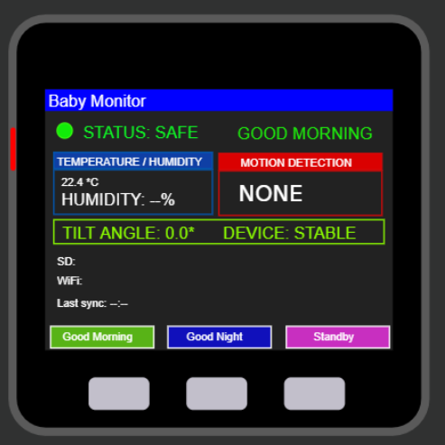
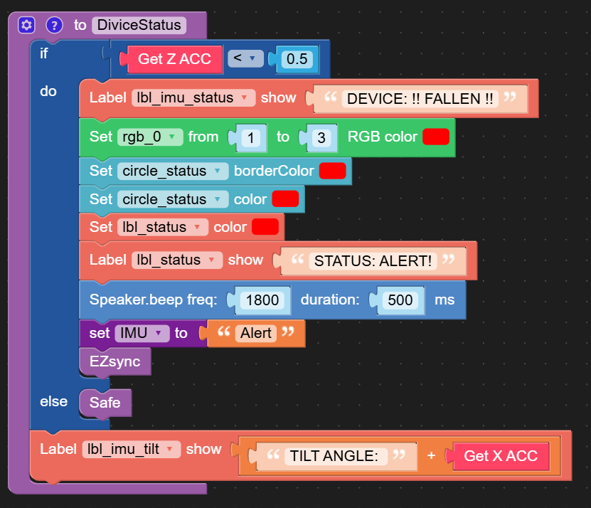
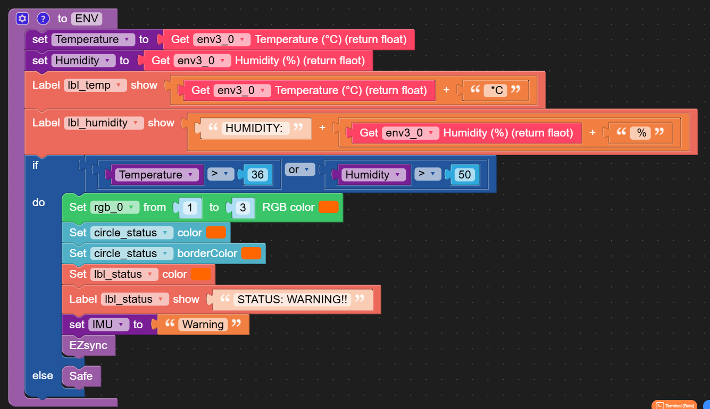
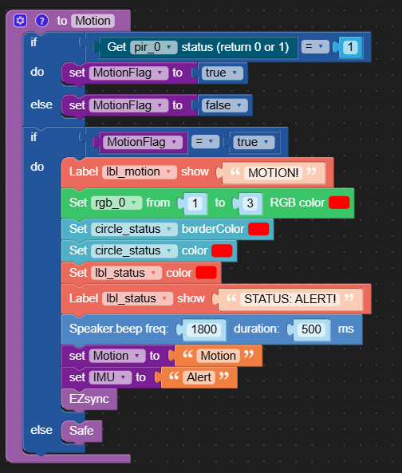
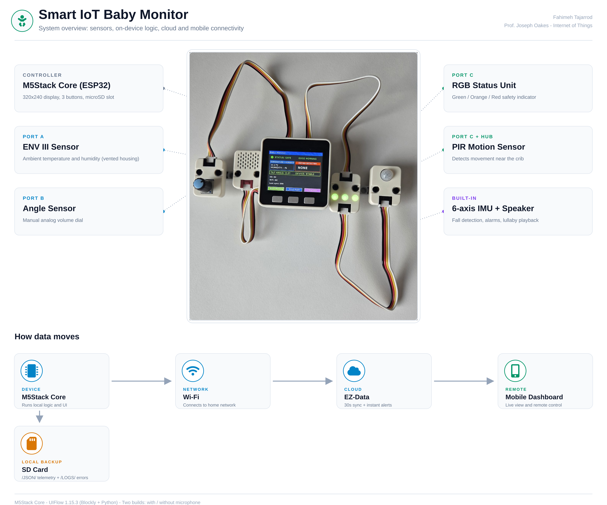
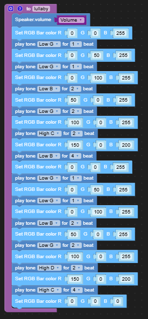

# 👶 Smart Baby Monitor — M5Stack IoT Project

An IoT baby monitoring system built on the **M5Stack Core** that tracks temperature, humidity, motion, and fall/tilt events in real time — with on-device alerts, a lullaby "night mode," SD-card logging, and a companion mobile dashboard.

Built by **Fahimeh Tajarrod** as a final project for an IoT course.

---

## Overview

The device runs three modes, switchable with the M5Stack's physical buttons or remotely from the mobile dashboard:

| Mode | Trigger | Behavior |
|---|---|---|
| **Good Morning** | Button A | Base monitoring mode — live sensor readings and status |
| **Good Night** | Button B | Plays a Brahms lullaby with a synced LED light show, then returns to Morning mode |
| **Standby** | Button C | Screen elements hidden, monitoring paused |

A color-coded status indicator (green / orange / red) reflects the current safety state:

| Status | Condition | Color |
|---|---|---|
| Safe | Normal readings | Green |
| Warning | Temperature > 36°C or humidity > 50% | Orange |
| Alert | Motion detected or device has fallen | Red |

## Features

- **Environmental monitoring** — temperature & humidity via the ENV III unit
- **Motion detection** — PIR sensor
- **Fall / tilt detection** — onboard IMU
- **Visual status indicator** — RGB unit with Safe / Warning / Alert states
- **Audio** — alarm tones and a Brahms lullaby for night mode, with a matching LED light dance
- **Data logging** — telemetry and error events written to the SD card as JSON, synced periodically to EZData (every 30s, plus instantly on motion, falls, or mode changes)
- **Mobile dashboard** — remote view of live readings and remote control of mode/volume via M5Stack's Remote+ widgets
- **Two hardware configurations** — with or without a microphone module (see [Hardware](#hardware))

## Hardware

Built on the **M5Stack Core (Basic/Gray)**, programmed in **UIFlow 1.15.3** (Blockly with embedded Python).

**Version without microphone:**
| Port | Component |
|---|---|
| A | ENV III (temperature/humidity) |
| B | Angle sensor (used as a volume dial) |
| C + Hub | RGB unit + PIR motion sensor |

**Version with microphone:**
| Port | Component |
|---|---|
| A | ENV III |
| B | Microphone |
| C + Hub | RGB unit + PIR motion sensor |

> The angle sensor was dropped in the microphone version to free up Port B — a physical volume dial and a microphone couldn't be run at once.

## Software Structure

**Setup:** WiFi init → SD card init → UI initialization → set Safe state → initial EZData sync

**Main loop:**
```
if angle changed        → update volume
sync speaker volume
if 30s since last sync   → sync EZData + log telemetry to SD
route to Standby / Night / Morning handler
wait 500ms
```

An immediate out-of-cycle sync also fires on motion detection, a fall event, or a mode change (button press).

Full source: [`code/baby_monitor.py`](code/baby_monitor.py) (exported from UIFlow) and [`code/Project5.m5f`](code/Project5.m5f) (UIFlow project file).

## Screenshots

| | |
|---|---|
|  |  |
|  |  |
|  |  |

More screenshots, wiring diagrams, and device photos are in [`images/`](images/).

## Documentation

- [`docs/ProjectStatus.md`](docs/ProjectStatus.md) — full project status: variables, UI element reference, mobile dashboard widgets, RGB logic, and known issues
- [`docs/Presentation.pptx`](docs/Presentation.pptx) — final presentation slides
- [`docs/Project_Report.docx`](docs/Project_Report.docx) — written project report

## Sample Data

Example JSON payloads logged by the device are in [`data/`](data/) — one telemetry snapshot and one error-log entry (an EZData sync failure with retry).

## Known Issues

- Occasional WiFi connection errors, handled with try/except retries
- WorldTimeAPI integration didn't work reliably — the on-screen clock stays at `--:--`
- The microphone doesn't work reliably when wired directly to Port B (floating-pin noise)

## Author

**Fahimeh Tajarrod**
